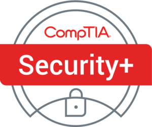

# هذه الورقة تحتوي على ملخص شامل (Notes / Cheatsheet) لشهادة CompTIA Security+ SY0-701

**أهداف امتحان شهادة CompTIA Security+ رقم الامتحان: SY0-701.**

---
**معلومات حول الامتحان**

سيؤكد امتحان شهادة CompTIA Security+ أن المرشح الناجح يمتلك المعرفة والمهارات اللازمة لـ:

- تقييم وضع الأمان في بيئة المؤسسات وتوصية وتنفيذ الحلول الأمنية المناسبة.
- مراقبة وتأمين البيئات الهجينة، بما في ذلك السحابة، والهواتف المحمولة، وإنترنت الأشياء (IoT).
- العمل مع الوعي باللوائح والسياسات المطبقة، بما في ذلك مبادئ الحوكمة والمخاطر والامتثال.
- التعرف على الأحداث الأمنية وتحليلها والاستجابة لها.

**تطوير الامتحان**

تنتج امتحانات CompTIA عن ورش عمل للخبراء في الموضوع ونتائج مسح على مستوى الصناعة تتعلق بالمهارات والمعرفة المطلوبة من المحترفين في تكنولوجيا المعلومات.

**سياسة استخدام المواد المعتمدة من CompTIA**

تُعلن شركة CompTIA Certifications, LLC أنها ليست مرتبطة ولا تُفوض أو تدعم أو توافق على استخدام أي محتوى مقدم من مواقع تدريب غير معتمدة (المعروفة أيضًا باسم "brain dumps"). الأفراد الذين يستخدمون مثل هذه المواد للتحضير لأي امتحان من CompTIA سيتم إلغاء شهاداتهم وإيقافهم عن الاختبار في المستقبل وفقًا لاتفاقية مرشح CompTIA. في محاولة للتواصل بشكل أكثر وضوحًا بشأن سياسات امتحانات CompTIA المتعلقة باستخدام المواد الدراسية غير المعتمدة، توجه CompTIA جميع مرشحي الشهادات إلى سياسات امتحان الشهادات من CompTIA. يُرجى مراجعة جميع سياسات CompTIA قبل بدء عملية الدراسة لأي امتحان من CompTIA. سيتعين على المرشحين الالتزام باتفاقية مرشح CompTIA. إذا كان لدى المرشح سؤال حول ما إذا كانت المواد الدراسية تعتبر غير معتمدة (المعروفة أيضًا باسم "brain dumps")، يجب عليه/عليها الاتصال بـ CompTIA على examsecurity@comptia.org للتأكيد.

**ملاحظة هامة**

القوائم المقدمة في صيغة نقطية ليست قوائم شاملة. قد تتضمن الأمثلة الأخرى من التقنيات أو العمليات أو المهام المتعلقة بكل هدف أيضًا في الامتحان، على الرغم من عدم ذكرها أو تغطيتها في وثيقة الأهداف هذه. تقوم CompTIA بمراجعة محتوى امتحاناتها باستمرار وتحديث أسئلة الاختبار لضمان أن امتحاناتنا محدثة وأن أمان الأسئلة محمي. عند الحاجة، سننشر امتحانات محدثة بناءً على الأهداف الحالية للامتحان. يُرجى العلم بأن جميع المواد التحضيرية ذات الصلة ستظل صالحة.

---
**تفاصيل الامتحان**

- **رقم الامتحان**: SY0-701  
- **عدد الأسئلة**: حد أقصى 90  
- **أنواع الأسئلة**: اختيار من متعدد وعمليات قائمة على الأداء  
- **مدة الاختبار**: 90 دقيقة  
- **الخبرة الموصى بها**: حد أدنى من سنتين من الخبرة في إدارة تكنولوجيا المعلومات مع التركيز على الأمان، وخبرة عملية في الأمن المعلوماتي الفني، ومعرفة واسعة بمفاهيم الأمان  

**أهداف الامتحان (المجالات)**

الجدول أدناه يوضح المجالات التي يقيسها هذا الامتحان ونسبة تمثيل كل منها:

| المجال                                        | نسبة الامتحان |
|-----------------------------------------------|----------------|
| 1.0 مفاهيم الأمان العامة                      | 12%            |
| 2.0 التهديدات والثغرات والتخفيفات          | 22%            |
| 3.0 هيكلية الأمان                             | 18%            |
| 4.0 عمليات الأمان                             | 28%            |
| 5.0 إدارة البرامج الأمنية والإشراف          | 20%            |
| **الإجمالي**                                  | **100%**       |

---
## 1.0 مفاهيم الأمن العامة (General Security Concepts)

### 1.1 قارن ووازن بين الأنواع المختلفة من ضوابط الأمن.

- **الفئات (Categories)**  

  - **الضوابط الفنية (Technical)**  
    **التعريف:** أدوات تقنية تُستخدم لحماية الأنظمة والبيانات.  
    **المثال:** جدار حماية يُستخدم لمنع الوصول غير المصرح به إلى الشبكة.  

  - **الضوابط الإدارية (Managerial)**  
    **التعريف:** سياسات وإجراءات تضعها الإدارة لضمان الأمان في المؤسسة.  
    **المثال:** تدريب سنوي للموظفين حول الأمن السيبراني لتعزيز الوعي والممارسات الأمنية.  

  - **الضوابط التشغيلية (Operational)**  
    **التعريف:** إجراءات يومية تُنفذ للحفاظ على الأمان واستمرارية العمليات.  
    **المثال:** تحقق من هوية الموظفين عند دخولهم إلى المناطق الحساسة باستخدام بطاقات التعريف.  

  - **الضوابط الفيزيائية (Physical)**  
    **التعريف:** تدابير لحماية المباني والمعدات من التهديدات الفيزيائية.  
    **المثال:** أنظمة مراقبة الفيديو (CCTV) في المداخل لرصد الأنشطة والتأكد من الأمان.  

- **أنواع الضوابط (Control types)**  

  - **الضوابط الوقائية (Preventive)**  
    **التعريف:** ضوابط تهدف إلى منع حدوث الحوادث أو المخاطر قبل وقوعها.  
    **المثال:** تركيب أنظمة تشفير لحماية البيانات الحساسة من الوصول غير المصرح به.  

  - **الضوابط الردعية (Deterrent)**  
    **التعريف:** ضوابط تهدف إلى ردع الأفراد عن ارتكاب الأفعال غير القانونية أو غير المرغوب فيها.  
    **المثال:** وجود لافتات تحذيرية تشير إلى أن المنطقة تحت المراقبة بالكاميرات.  

  - **الضوابط الاستكشافية (Detective)**  
    **التعريف:** ضوابط تُستخدم لاكتشاف الحوادث أو المخاطر بعد وقوعها.  
    **المثال:** أنظمة كشف التسلل التي تنبه الإدارة عند وجود نشاط غير عادي على الشبكة.  

  - **الضوابط التصحيحية (Corrective)**  
    **التعريف:** ضوابط تُنفذ لتصحيح المشكلات أو الأضرار التي حدثت بالفعل.  
    **المثال:** تحديث البرمجيات بعد اكتشاف ثغرة أمنية لإصلاح الثغرات.  

  - **الضوابط التعويضية (Compensating)**  
    **التعريف:** ضوابط بديلة تُستخدم لتعويض نقص في ضوابط أخرى.  
    **المثال:** استخدام التشفير كبديل لحماية البيانات عندما لا يمكن تطبيق الوصول المباشر.  

  - **الضوابط الإرشادية (Directive)**  
    **التعريف:** ضوابط تُحدد السياسات والتوجيهات التي يجب على الأفراد اتباعها.  
    **المثال:** وثائق السياسات الأمنية التي تحدد الإجراءات الواجب اتباعها لحماية المعلومات.  

### 1.2 تلخيص المفاهيم الأساسية للأمن.

- **السرية (Confidentiality)، السلامة (Integrity)، التوفر (Availability) أختصاراً (CIA)**  

	- **السرية (Confidentiality)**  
	  **التعريف:** حماية المعلومات من الوصول غير المصرح به.  
	  **المثال:** استخدام **التشفير** لحماية البيانات الحساسة.  

	- **السلامة (Integrity)**  
	  **التعريف:** ضمان دقة المعلومات وعدم تغييرها بدون إذن.  
	  **المثال:** استخدام **خوارزميات التجزئة** للتحقق من عدم تعديل البيانات.  

	- **التوفر (Availability)**  
	  **التعريف:** ضمان وصول المستخدمين المصرح لهم إلى المعلومات عند الحاجة.  
	  **المثال:** استخدام **نسخ احتياطية** لضمان الوصول في حالة حدوث فشل في النظام.  

- **عدم التنصل (Non-repudiation)**  
  **التعريف:** ضمان عدم قدرة الأفراد على إنكار صحة توقيعهم أو مشاركتهم في عملية معينة.  
  **المثال:** استخدام **التوقيع الرقمي** لتأكيد هوية المرسل، مما يمنعهم من إنكار إرسال رسالة.  

- **المصادقة (Authentication)، التفويض (Authorization)، والمحاسبة (Accounting) أختصاراً (AAA)**  

  - **المصادقة للأشخاص (Authenticating people)**  
    **التعريف:** التحقق من هوية المستخدمين (users).  
    **المثال:** استخدام كلمات المرور (passwords) أو بصمات الأصابع (fingerprints).  

  - **المصادقة للأنظمة (Authenticating systems)**  
    **التعريف:** التحقق من هوية الأنظمة (systems) أو الأجهزة (devices).  
    **المثال:** استخدام الشهادات الرقمية (digital certificates).

  - **نماذج التفويض (Authorization models)**  
    **التعريف:** تحديد الأذونات (permissions) المتاحة للمستخدمين.  
    **المثال:**  
    - **نموذج التحكم في الوصول القائم على الدور (RBAC)**  
      **التعريف:** يمنح الأذونات بناءً على دور المستخدم (user role) في المؤسسة.  
      **المثال:** مدير النظام يحصل على أذونات أعلى من المستخدمين العاديين.

    - **نموذج التحكم في الوصول القائم على القوائم (ACL)**  
      **التعريف:** يحدد الأذونات لكل مستخدم (user) بشكل فردي.  
      **المثال:** تحديد من يمكنه قراءة أو تعديل ملف معين.

    - **نموذج التحكم في الوصول القائم على الخصائص (ABAC)**  
      **التعريف:** يعتمد على خصائص المستخدم (user attributes) وبيئة الوصول (access environment) لتحديد الأذونات.  
      **المثال:** السماح بالوصول فقط للموظفين الذين يعملون في قسم معين خلال ساعات العمل.

    - **نموذج OAuth**  
      **التعريف:** يتيح للمستخدمين منح تطبيقات خارجية (third-party applications) الوصول إلى معلوماتهم دون مشاركة كلمات المرور.  
      **المثال:** تسجيل الدخول إلى تطبيق باستخدام حساب Google أو Facebook.

- **تحليل الفجوات (Gap Analysis)**  
	**التعريف:** هو عملية تقييم الفرق بين الحالة الحالية (current state) والهدف المنشود (desired state) في سياق الأداء أو الأمان أو العمليات. يُستخدم لتحديد النقاط الضعيفة (weaknesses) والمجالات التي تحتاج إلى تحسين.
	**المثال:** تحليل الفجوات في نظام أمان المعلومات لتحديد الثغرات الأمنية التي يجب معالجتها قبل الوصول إلى مستوى الأمان المطلوب.

- **ثقة صفرية (Zero Trust)**  
  **التعريف:** نموذج أمان يعتمد على عدم الثقة بأي كيان ويتطلب تحقق مستمر من الهوية للوصول.  
  **المثال:** التحقق من هوية المستخدمين قبل منحهم الوصول للبيانات.  

  - **طائرة التحكم (Control Plane)**  
    - **الهوية القابلة للتكيف (Adaptive identity)**  
      **التعريف:** يتكيف النظام مع سياقات المستخدمين.  
      **المثال:** استخدام التحقق متعدد العوامل.  

    - **تقليل نطاق التهديد (Threat scope reduction)**  
      **التعريف:** تقليل التعرض للهجمات.  
      **المثال:** فصل الشبكات الحساسة.  

    - **التحكم في الوصول المدفوع بالسياسات (Policy-driven access control)**  
      **التعريف:** تحديد الوصول بناءً على السياسات.  
      **المثال:** منح الوصول حسب دور المستخدم.  

    - **مدير السياسات (Policy Administrator)**  
      **التعريف:** المسؤول عن إنشاء وتعديل السياسات.  
      **المثال:** مسؤول الأمان في المؤسسة.  

    - **محرك السياسات (Policy Engine)**  
      **التعريف:** ينفذ السياسات ويقرر الوصول.  
      **المثال:** نظام تقييم الطلبات بناءً على السياسات.  

  - **طائرة البيانات (Data Plane)**  
    - **مناطق الثقة الضمنية (Implicit trust zones)**  
      **التعريف:** مناطق تعتبر موثوقة.  
      **المثال:** الشبكة الداخلية للمؤسسة.  

    - **الموضوع/النظام (Subject/System)**  
      **التعريف:** المستخدمون أو الأنظمة التي تطلب الوصول.  
      **المثال:** مستخدم يتطلب الوصول لقاعدة بيانات.  

    - **نقطة تطبيق السياسات (Policy Enforcement Point)**  
      **التعريف:** الموقع الذي يتم فيه تطبيق السياسات.  
      **المثال:** جدار الحماية.  

- **الأمن الفيزيائي (Physical Security)**  
  **التعريف:** تدابير لحماية المنشآت والمعدات من التهديدات الفيزيائية.  

  - **حواجز (Bollards)**  
    **التعريف:** أعمدة قصيرة تستخدم لحماية المباني من التصادمات.  
    **المثال:** حواجز خرسانية حول المداخل.  

  - **فناء التحكم في الوصول (Access control vestibule)**  
    **التعريف:** منطقة بين مدخلين تُستخدم للتحقق من الهوية قبل الدخول.  
    **المثال:** غرفة تفتيش أمنية في المباني.  

  - **السياج (Fencing)**  
    **التعريف:** جدران أو حواجز مادية تُستخدم لتحديد وحماية المساحات.  
    **المثال:** سياج حول المنشآت الصناعية.  

  - **مراقبة الفيديو (Video surveillance)**  
    **التعريف:** استخدام الكاميرات لرصد الأنشطة في منطقة معينة.  
    **المثال:** أنظمة CCTV لمراقبة المداخل.  

  - **حارس الأمن (Security guard)**  
    **التعريف:** موظف مسؤول عن مراقبة وحماية المنشأة.  
    **المثال:** حارس أمن متواجد عند المدخل الرئيسي.  

  - **شعار الوصول (Access badge)**  
    **التعريف:** بطاقة تستخدم للتحقق من الهوية والسماح بالدخول.  
    **المثال:** بطاقة هوية الموظف للدخول إلى المبنى.  

  - **الإضاءة (Lighting)**  
    **التعريف:** استخدام الأضواء لتحسين الرؤية والأمان في المناطق.  
    **المثال:** إضاءة المسارات الخارجية حول المنشأة لضمان سلامة المشاة في الليل.  

  - **أجهزة الاستشعار (Sensors)**  
    - **الأشعة تحت الحمراء (Infrared)**  
      **التعريف:** أجهزة تكشف الحركة باستخدام الأشعة تحت الحمراء.  
      **المثال:** مستشعرات الحركة في أنظمة الإنذار.  

    - **الضغط (Pressure)**  
      **التعريف:** أجهزة تكشف الوزن أو الضغط لتحديد الحركة.  
      **المثال:** حصائر الضغط عند الأبواب.  

    - **الميكروويف (Microwave)**  
      **التعريف:** أجهزة تستخدم الموجات الميكروويف للكشف عن الحركة.  
      **المثال:** مستشعرات ميكروويف تُستخدم في أنظمة الأمان لكشف حركة الأشخاص في ساحات الانتظار.  

    - **الألتراساونيك (Ultrasonic)**  
      **التعريف:** أجهزة تستخدم الموجات فوق الصوتية للكشف عن الحركة.  
      **المثال:** أنظمة إنذار الأمان في المداخل.  

- **تقنية الخداع والتعطيل (Deception and Disruption Technology)**  

